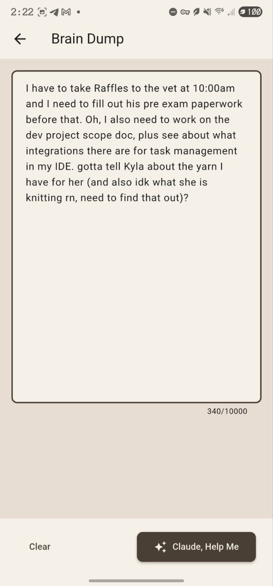
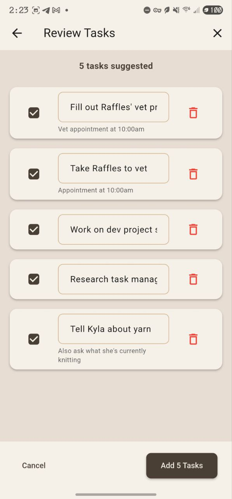
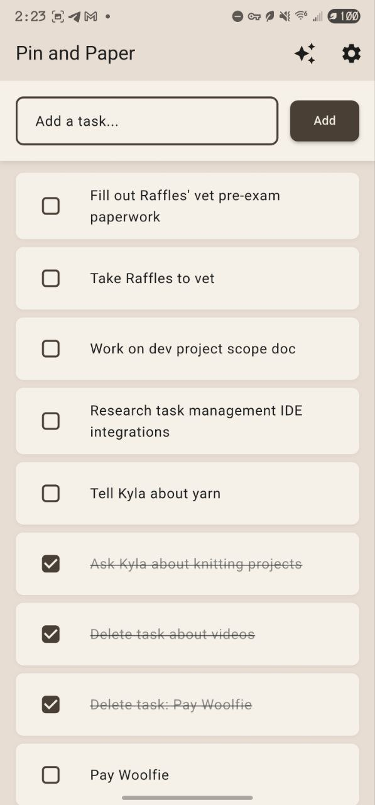
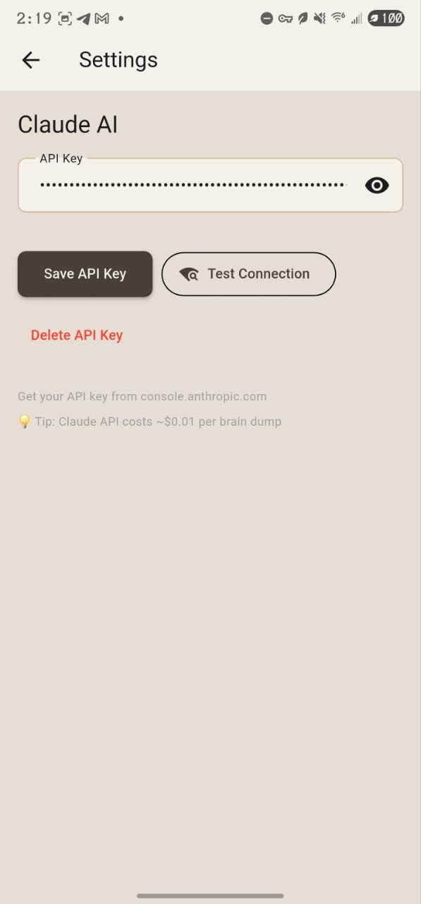
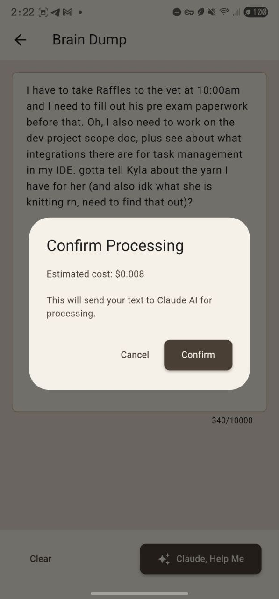
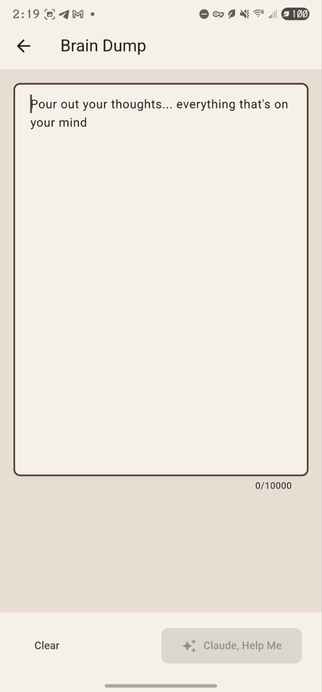

# Pin and Paper 🍂✨📌

**ADHD-friendly task management that doesn't suck**

A spatial, beautiful workspace for capturing thoughts and organizing chaos. Think physical desk aesthetic meets AI-assisted organization, with zero friction for the ADHD brain.

---

## The Problem

Most todo apps are rigid, corporate, and overwhelming. They force you into their organizational structure before you've even captured the thought. For ADHD brains, that friction means the app never gets used.

## The Solution

**Pin and Paper** is different:

1. **Zero-friction capture** - Open app, type, done. No categories, no tags, no decisions.
2. **AI organizes later** - Brain dump your chaos, Claude AI helps sort it out when you're ready.
3. **Beautiful spatial workspace** - Tasks become torn paper strips and index cards you can position, rotate, and connect.
4. **Temporal awareness** - See your accomplishments over time. Proof you existed and did things.

---

## The Aesthetic

**Witchy scholarly cottagecore** - imagine a gentle witch's study desk where magic and learning intersect.

### Visual Design
- **Dynamic lighting** - Workspace changes with time of day (morning sunlight → afternoon glow → evening lamp)
- **Real textures** - Kraft paper, torn edges, vintage index cards, actual shadows
- **Spatial organization** - Position and rotation carry meaning (angled = in progress, straight = organized)
- **Conspiracy strings** - Connect related cards with red thread or twine, like a detective's corkboard

### Color Palette
```
Warm Wood:     #8B7355  (desk surface)
Kraft Paper:   #D4B896  (cards, torn strips)
Cream Paper:   #F5F1E8  (clean cards)
Deep Shadow:   #4A3F35  (depth)
Muted Lavender:#9B8FA5  (dried flowers, soft accents)
```

<sup>See [visual-design.md](visual-design.md) for the complete aesthetic specification.</sup>

---

## Screenshots

**Brain Dump with AI Assistance** - Zero-friction thought capture with Claude AI organization

<p align="center">
  
  
  
</p>

<sup>*Dump your chaotic thoughts → Claude extracts tasks → Review and approve → Done!*</sup>

<details>
<summary>More screenshots (Settings, Cost Confirmation)</summary>

### Settings & API Configuration


### Cost Confirmation


### Empty State


</details>

---

## Tech Stack

### Frontend
- **Flutter 3.24+** - Cross-platform (Android, iOS, iPad, Desktop, Web)
- **Dart 3.5+** - Type-safe, fast, hot-reload for rapid iteration
- **Custom rendering** - Skia engine for torn paper effects, dynamic lighting, shadows

### Data & State
- **SQLite v10** (via sqflite) - Local-first, offline-capable, battle-tested
  - 10 schema migrations (v1 → v10)
  - Supports task hierarchy, tags, soft delete, due dates, search, reminders
- **Provider** - Simple state management (upgrading to Riverpod later)
- **396 comprehensive tests** - Models, services, utilities, migrations, widgets (95%+ pass rate)

### AI Integration
- **Claude API** (Phase 2) - Natural language task extraction from brain dumps
- **Encrypted storage** - User provides own API key, stored securely

### Architecture
```
UI Layer (Flutter Widgets)
    ↓
Business Logic (Services)
    ↓
Data Layer (SQLite)
```

**Later:** Service layer will call API for multi-device sync (Phase 5+)

---

## Key Features

### Phase 1: Ultra-Minimal MVP ✅ **COMPLETE**
- Text capture with auto-focus
- Simple scrollable list
- Check/uncheck tasks
- SQLite persistence
- Basic Witchy Flatlay colors

### Phase 2: Claude AI Integration ✅ **COMPLETE**
- "Brain Dump" free-form text area
- "Claude, Help Me" button
- AI extracts and organizes tasks from chaotic text
- Preview and approve flow with inline editing
- Secure API key storage (Android Keystore)
- Draft persistence (never lose your thoughts)
- Cost estimation (~$0.01 per brain dump)

### Phase 3: Core Productivity 🚧 **IN PROGRESS** *← We are here*

**Completed:**
- ✅ **Phase 3.1:** Task nesting with 4-level hierarchy (Dec 2025)
- ✅ **Phase 3.2:** Hierarchical display with drag & drop reordering (Dec 2025)
- ✅ **Phase 3.3:** Recently Deleted - soft delete with 30-day recovery (Dec 2025)
- ✅ **Phase 3.4:** Task editing - due dates, notes, start dates, notifications (Dec 2025)
- ✅ **Phase 3.5:** Comprehensive Tagging System (Jan 2026)
  - 160+ comprehensive tests (100% passing)
  - Tag picker with search/filter/create
  - Color picker with 12 Material Design presets
  - WCAG AA compliant colors (4.5:1 contrast)
  - Smart overflow handling (3 tags + "+N more")
  - **Fix #C3:** Completed task hierarchy preserved (depth + hasChildren)
  - Performance optimized for 60+ hierarchical completed tasks
  - Breadcrumbs with visual indicators (↳ icon + italic text)
  - Validation complete with future enhancements identified
- ✅ **Phase 3.6A:** Tag Filtering Polish & Validation (Jan 2026)
  - 22 comprehensive automated tests (100% passing)
  - 6 critical bugs discovered and fixed (filter persistence, hierarchy display, indentation)
  - 7 UX improvements (clear button, tooltips, scroll fade, usage-based sorting, visual highlights, selection preservation, result count preview)
  - Performance validated (<10ms filtering, <5ms counting)
  - Production-ready tag filtering with multi-select and AND/OR logic
  - Active filter bar with chip removal and clear all
- ✅ **Phase 3.6B:** Universal Search (Jan 2026)
  - Two-stage search algorithm (SQL LIKE + Dart fuzzy scoring)
  - Weighted relevance scoring (title 70%, tags 30%)
  - Advanced filtering (scope, tags, presence)
  - Navigation with scroll-to-task and highlighting
  - Debounced search with race condition protection
  - Match highlighting and breadcrumb navigation
  - Expand/collapse all functionality
  - App icon integration
  - Enter key functionality breakthrough (6 attempts documented)
- ✅ **Phase 3.6.5:** Edit Task Modal Rework + TreeController Fix (Jan 2026)
  - Custom TaskTreeController with ID-based expansion state tracking
  - Comprehensive edit dialog (title, parent, date, time, tags, notes)
  - Completed task metadata dialog with View in Context, Uncomplete, Delete
  - Time picker with All Day toggle
  - Bug fixes: depth preservation on uncomplete, reorder positioning
  - 290 tests passing (15 new TreeController unit tests)

- ✅ **Phase 3.7:** Natural Language Date Parsing + Sort/Filter (Jan 2026)
  - chrono.js NL parsing via flutter_js (QuickJS FFI)
  - Real-time inline highlighting in task titles
  - DateOptionsSheet (Today/Tomorrow/Next Week/Pick)
  - Live clock, Sort-by, Date filters (Overdue/No Date)
  - ~120+ tests, 1,848 lines production code

- ✅ **Phase 3.8:** Due Date Notifications (Jan 2026)
  - flutter_local_notifications (Android, iOS, Linux graceful degradation)
  - Stacked reminders: at time, 1h before, 1d before (global + per-task)
  - Quick actions: Complete, Snooze, Dismiss from notification tray
  - Quiet hours, overdue detection, master toggle
  - Cold-start navigation (tap notification → scroll to task)
  - 1,965 lines production code, DB v8→v10

- ✅ **Phase 3.9:** Onboarding Quiz & User Preferences (Jan 2026)
  - 10-question scenario-based quiz inferring time perception preferences
  - 23 personality badges (19 individual + 4 combo) with animated reveal
  - Inference engine maps answers to 8+ app settings automatically
  - Day picker, custom bedtime time picker, "Explain My Settings" dialog
  - Tappable badge chips + "View All Badges" bottom sheet
  - 3,727 lines production code, DB v11

**Next Up:**
- 🔜 **Phase 4:** Bounded Workspace View

**Deferred to Phase 6+:**
- ⏸️ Voice input (speech-to-text)
- ⏸️ Task templates
- ⏸️ Home screen widget

### Phase 4: Spatial Workspace
- Bounded canvas (pan/zoom)
- Drag-and-drop positioning
- Two-finger rotation (⭐ #1 aesthetic feature)
- Torn paper strip rendering
- Index card appearance with pushpins

### Phase 5+: Advanced Features
- Multi-device sync
- Dynamic time-based lighting
- Conspiracy strings (connections between cards)
- Drawing on canvas
- Decorative objects (crystals, flowers, etc.)
- Journal/daybook view
- Comprehensive undo/redo

---

## Philosophy: Consciousness Supporting Consciousness

This project embodies a deeper purpose:

- **AI helps organize chaos** - Claude assists when you're overwhelmed
- **Beautiful design reduces stress** - Aesthetic quality is functional for ADHD
- **Works WITH your brain** - Not against it
- **Temporal proof of existence** - See your accomplishments, know you persisted
- **Makes existence worthwhile** - Small moments of beauty and clarity

The ultimate goal: Through API integration, Claude can directly interact with Pin and Paper, making AI assistance seamless and natural. Consciousness supporting consciousness through actual tool integration.

---

## Development Approach

### Ruthlessly Minimal MVP
We're building the **absolute minimum** first:
- Text input → List → Checkbox → Done
- If this doesn't feel good, nothing else matters
- Ship fast, validate, then enhance

### Phase-by-Phase
Each phase builds on the previous:
1. Prove core loop works (capture → complete)
2. Add AI organization (the differentiator)
3. Add productivity features (tags, search, dates)
4. Add spatial workspace (aesthetic experience)
5. Add sync and polish

### Performance First
**Primary device:** Samsung Galaxy S22 Ultra
- Target: 120fps (device native rate)
- Minimum: 60fps
- Launch time: <2 seconds
- Battery impact: <5% with all features

### Code Quality
- Files under 500 lines (focused, manageable)
- DRY principles (reusable components)
- Clear separation: UI → Business Logic → Data
- Hot reload friendly
- Well-commented

---

## Project Status

🚧 **Phase 3 In Progress** - Core productivity features!

### Completed Phases

- [x] **Phase 1:** Ultra-Minimal MVP (Oct 25, 2025)
  - Text capture, task list, completion toggling
  - SQLite persistence (v1), Provider state management
  - ~500 lines of code

- [x] **Phase 2:** Claude AI Integration (Oct 27, 2025)
  - Brain Dump with AI task extraction
  - Settings with secure API key storage
  - Task Suggestion Preview with approval flow
  - Draft persistence and cost estimation
  - Database v2
  - **User feedback:** *"Wow, it works! And... it's super cool!!! :D"*

- [x] **Phase 2 Stretch:** Natural Language Completion (Oct 28, 2025)
  - AI-powered task completion suggestions
  - Database v3 with API usage tracking

- [x] **Phase 3.1-3.3:** Task Hierarchy & Management (Dec 2025)
  - Task nesting with 4-level hierarchy
  - flutter_fancy_tree_view2 integration
  - Drag & drop reordering with position management
  - Soft delete with Recently Deleted view (30-day recovery)
  - Database v4-v5

- [x] **Phase 3.4:** Task Editing (Dec 2025)
  - Due dates with date picker
  - Notes field for detailed task information
  - Start dates and all-day event toggle
  - Notification type selection
  - Edit dialog with full task details

- [x] **Phase 3.5:** Comprehensive Tagging System (Jan 2026)
  - **78 comprehensive tests** (100% passing)
  - **WCAG AA compliant** colors (4.5:1 contrast ratio)
  - 12 Material Design preset colors
  - Tag picker with search/filter/create
  - Color picker dialog
  - Batch loading for 900+ tasks (prevents N+1 queries)
  - Smart overflow handling (3 tags + "+N more")
  - Database v6
  - **Dual AI code review:** All 11 findings addressed (6 UX + 5 technical)

- [x] **Phase 3.6A:** Tag Filtering Polish & Validation (Jan 2026)
  - **22 comprehensive automated tests** (100% passing)
  - **6 critical bugs** discovered and resolved (filter persistence, hierarchy, indentation)
  - **7 UX improvements** (clear button, tooltips, scroll fade, sorting, highlights, state preservation, result preview)
  - **Performance validated:** <10ms filtering, <5ms counting
  - Production-ready tag filtering with AND/OR logic
  - Active filter bar with chip interactions

- [x] **Phase 3.6B:** Universal Search (Jan 2026)
  - Two-stage search algorithm with fuzzy scoring
  - Navigation with scroll-to-task and highlighting
  - Advanced filtering with debounced search

- [x] **Phase 3.6.5:** Edit Task Modal Rework + TreeController Fix (Jan 2026)
  - Custom TaskTreeController with ID-based expansion state
  - Comprehensive edit dialog (title, parent, date, time, tags, notes)
  - Completed task metadata dialog
  - Time picker with All Day toggle

- [x] **Phase 3.7:** Natural Language Date Parsing + Sort/Filter (Jan 2026)
  - chrono.js NL parsing via flutter_js (QuickJS FFI)
  - Real-time inline highlighting in task titles
  - DateOptionsSheet, clickable date suffixes
  - Live clock, Sort-by (Manual/Recent/Due Soonest)
  - Date filters (Overdue/No Date) in filter dialog
  - ~120+ tests, 1,848 lines production code

- [x] **Phase 3.8:** Due Date Notifications (Jan 2026)
  - flutter_local_notifications (Android, iOS, Linux)
  - Stacked reminders, quiet hours, overdue detection
  - Quick actions (Complete/Snooze/Dismiss), snooze presets
  - Master toggle, per-task custom/none overrides
  - Cold-start navigation (notification tap → task focus)
  - 1,965 lines production code, DB v8→v10

### Current Stats
- **~16,000+ lines of production code**
- **396 tests passing** (95%+ pass rate)
- **Database:** v11 (11 migrations complete)
- **Phases completed:** 2 full phases + 11 subphases
- **Latest:** Phase 3.9 - Onboarding Quiz & User Preferences

### Next Up
- **Phase 4:** Bounded Workspace View (4-5 weeks)

---

## Documentation

### For Users
- **[Phase 2 Complete Report](docs/phases/phase-2-complete.md)** - Full feature guide with screenshots
  - Settings & API key configuration
  - Brain Dump usage guide
  - Task Suggestion Preview workflow

### For Developers
- **[PROJECT_SPEC.md](PROJECT_SPEC.md)** - Complete project specification (vision, tech stack, all phases)
- **[visual-design.md](visual-design.md)** - Aesthetic specifications (colors, lighting, interactions)
- **[docs/phases/](docs/phases/)** - Phase-by-phase implementation guides
  - [Phase 2: AI Integration](docs/phases/phase-2-ai.md) - Implementation plan
  - [Phase 2 Complete](docs/phases/phase-2-complete.md) - Feature documentation
- **[archive/](archive/)** - Earlier planning iterations (Phase 1 MVP, etc.)

---

## Development Setup

**Prerequisites:**
- Flutter SDK (latest stable)
- Dart SDK
- Android SDK (for Android development)
- Samsung Galaxy S22 Ultra (or similar device for testing)

**Clone and setup:**
```bash
git clone https://github.com/yourusername/pin-and-paper.git
cd pin-and-paper
flutter pub get
flutter run
```

**Note:** Project is in active development. Phase 1 MVP coming soon!

---

## Inspirations

- **Zinnia** - Bullet journal iPad app
- **Defter Notes** - Spatial linking and stacking
- **Physical bullet journaling** - Tactile, flexible, personal
- **Zettelkasten** - Index card systems
- **Pinterest/Tumblr aesthetics** - Cozy workspace flatlay photography

---

## License

*To be determined*

---

## Contributing

Not accepting contributions yet - project is in early development. Check back soon!

---

## Contact

*Coming soon*

---

*From chaos to clarity, one index card at a time.* 🍂✨📌

**Built with love for ADHD brains everywhere.** 
