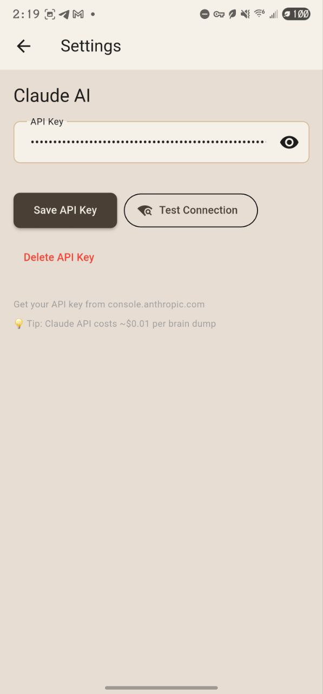
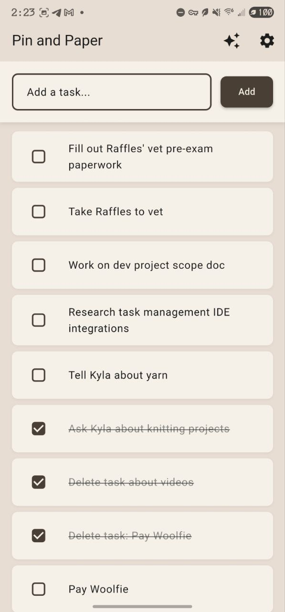

# Phase 2: AI Integration - COMPLETE ✅

**Status:** ✅ **Shipped to Production**
**Branch:** `phase-2-dev` → `main`
**Date Completed:** October 27, 2025
**Version:** 0.2.0

---

## 🎉 Overview

Phase 2 successfully integrated Claude AI for natural language task extraction from chaotic "brain dump" text. Users can now dump their thoughts without structure, and Claude AI organizes them into actionable tasks.

**Key Achievement:** Fully functional AI-powered task creation with secure API key storage, cost estimation, and draft persistence.

---

## ✅ Features Implemented

### 1. **Settings Screen** - API Key Configuration
**Location:** Tap ⚙️ Settings icon in home screen

**Features:**
- ✅ Secure API key storage (Android Keystore)
- ✅ API key visibility toggle (show/hide)
- ✅ **Test Connection** button with visual feedback
  - Green ✅ "Connected" on success
  - Red ❌ with error message on failure
  - Loading spinner during test
  - Supports rate limit detection (429 → green with warning)
- ✅ Delete API key with confirmation dialog
- ✅ Help text with link to console.anthropic.com
- ✅ Cost tip: "~$0.01 per brain dump"

**Technical:**
- Uses `flutter_secure_storage` ^9.0.0 (Android EncryptedSharedPreferences)
- Test API call uses only 10 tokens (~$0.0003 cost)
- API key validation: simple non-empty check (10+ chars)
- Never logs API keys in errors or debug output

**Screenshots:**

<details>
<summary>📸 View Settings Screen Screenshots</summary>


*Settings screen showing API key field with obscured text, visibility toggle, and action buttons (Save, Test Connection, Delete). Help text and cost tip displayed at bottom.*

</details>

---

### 2. **Brain Dump Screen** - Thought Capture
**Location:** Tap ✨ Brain Dump icon in home screen

**Features:**
- ✅ Large multi-line text field (auto-focus)
- ✅ Character counter (0 / 10,000)
- ✅ Exit confirmation dialog
  - Offers: Save Draft / Discard / Cancel
  - Triggers on back button, swipe gesture, or app bar back
  - Uses `PopScope` (Flutter 3.12+)
- ✅ Error banner at top (red background with message)
- ✅ Loading indicator during processing
- ✅ "Clear" button with confirmation
- ✅ **"Claude, Help Me"** button (primary action)
  - Disabled when text is empty
  - Disabled during processing
  - Shows loading spinner during API call

**Flow:**
1. User enters chaotic text
2. Tap "Claude, Help Me"
3. Check for API key → navigate to Settings if missing
4. Show cost confirmation dialog (~$0.01)
5. Call Claude API
6. On success → navigate to Task Suggestion Preview
7. On error → show error banner + auto-save draft

**Technical:**
- Max length: 10,000 characters
- Internet connectivity check before processing
- Draft auto-save on error (never lose user text!)
- Draft deletion on successful processing
- Cost estimation before API call

**Screenshots:**

<details>
<summary>📸 View Brain Dump Screenshots</summary>


*Empty Brain Dump screen with placeholder text and character counter showing 0/10000. "Claude, Help Me" button is disabled (grayed out) when field is empty.*


*Brain Dump screen with user's chaotic thoughts entered. Character counter shows 340/10000. "Claude, Help Me" button is now enabled and ready to process.*


*Cost confirmation dialog showing estimated cost ($0.008) before sending text to Claude AI. User can cancel or confirm to proceed with processing.*

</details>

---

### 3. **Task Suggestion Preview** - Review & Approve
**Location:** Auto-navigates after successful Brain Dump processing

**Features:**
- ✅ List of suggested tasks from Claude
- ✅ **Checkbox** - tap to approve/unapprove
- ✅ **Inline editing** - tap title to edit
- ✅ **Notes preview** - context from Claude (if provided)
- ✅ **Delete button** - remove suggestion
- ✅ Visual feedback:
  - Approved: normal appearance
  - Unapproved: grayed out with strikethrough
- ✅ Live count: "Add X Tasks" button updates in real-time
- ✅ Bulk creation: all approved tasks added in single transaction

**Flow:**
1. Review Claude's suggestions
2. Uncheck tasks you don't want
3. Edit titles inline if needed
4. Delete unwanted suggestions
5. Tap "Add X Tasks"
6. Navigate back to home screen
7. See all tasks in list

**Technical:**
- All tasks approved by default
- Uses `TaskService.createMultipleTasks()` for performance
- Single database transaction (no UI stuttering)
- Single `notifyListeners()` call (smooth UX)
- Success toast: "X tasks added!"

**Screenshots:**

<details>
<summary>📸 View Task Suggestion & Result Screenshots</summary>


*Task Suggestion Preview showing 5 tasks extracted from brain dump. Each task has a checkbox (all approved by default), editable title, optional notes from Claude, and delete button. "Add 5 Tasks" button at bottom shows live count of approved tasks.*


*Home screen showing the complete workflow result. All 5 tasks from the brain dump have been added to the task list. The screen also shows previously completed tasks (with strikethrough) demonstrating the app's task management capabilities.*

</details>

---

## 🏗️ Architecture

### New Models
- **TaskSuggestion** - Temporary task with approval state
  - `id`: UUID (reused when creating Task)
  - `title`: Task text
  - `notes`: Optional context from Claude
  - `approved`: User approval flag
  - `edited`: User edit flag

### New Services
- **SecureStorageService** - API key storage
  - Android Keystore integration
  - Singleton pattern

- **SettingsService** - API key management
  - Validation
  - Test connection (10-token API call)
  - Save/load/delete

- **ClaudeService** - AI integration
  - Model: `claude-sonnet-4-5`
  - Endpoint: `https://api.anthropic.com/v1/messages`
  - Cost estimation (~$0.01 per dump)
  - JSON parsing with markdown wrapper handling
  - Structured prompts for ADHD-friendly extraction

### New Providers
- **SettingsProvider** - Settings state
  - API key existence check
  - Initialize on app start

- **BrainDumpProvider** - Brain dump state
  - Text management
  - Processing state
  - Suggestions list
  - Draft persistence (upsert logic)
  - Connectivity checking
  - Error formatting

### Database Changes
- **Version:** 1 → 2
- **New table:** `brain_dump_drafts`
  - `id`: TEXT PRIMARY KEY
  - `content`: TEXT NOT NULL
  - `created_at`: INTEGER NOT NULL
  - `last_modified`: INTEGER NOT NULL
  - `failed_reason`: TEXT (error message if processing failed)
  - Index on `last_modified DESC`
- **Migration:** `onUpgrade` callback handles v1 users seamlessly

---

## 📊 Technical Highlights

### Performance Optimizations
✅ **Bulk Task Creation**
- Single database transaction for N tasks
- Single UI update instead of N updates
- No stuttering when adding 10+ tasks

✅ **Draft Upsert Logic**
- First save: INSERT with new UUID
- Subsequent saves: UPDATE existing draft
- No UUID leak from auto-save

✅ **Minimal API Calls**
- Test connection: 10 tokens (~$0.0003)
- Brain dump: ~500 tokens input + 500 output (~$0.01)
- Cost estimation before processing

### Security
✅ **API Key Protection**
- Android Keystore (hardware-backed encryption)
- Never logged in errors or debug output
- Only prefix shown in debug: `${apiKey.substring(0, 10)}...`
- Obscured in UI by default (toggle visibility)

✅ **Network Safety**
- Connectivity check before API calls
- Timeout protection (10 seconds)
- Graceful error handling
- User-friendly error messages

### UX Polish
✅ **Never Lose Text**
- Draft auto-save on error
- Exit confirmation with save option
- Draft persistence in database

✅ **Clear Feedback**
- Loading states (spinners)
- Success indicators (green ✅)
- Error states (red ❌)
- Live counts ("Add X Tasks")

---

## 🐛 Issues Fixed During Development

### Critical Fixes
1. ✅ **Database Migration Missing** - Added onUpgrade callback
2. ✅ **Connectivity API Version** - Verified ^6.0.0 uses List API
3. ✅ **Bulk Task Performance** - Added createMultipleTasks()
4. ✅ **Draft UUID Leak** - Implemented upsert logic
5. ✅ **API Key Validation Brittle** - Changed to simple non-empty check
6. ✅ **Test Connection Feature** - Implemented with visual feedback

### Compile Fixes
1. ✅ **String Interpolation** - Escaped `$` in settings screen
2. ✅ **Model Name 404** - Updated to `claude-sonnet-4-5`

### Implementation Reminders Applied
1. ✅ **AppConstants Usage** - All draft queries use constants
2. ✅ **429 Response Handling** - Shows success with warning

---

## 📦 Dependencies Added

**Phase 2 Dependencies:**
```yaml
http: ^1.2.0                      # Claude API requests
flutter_secure_storage: ^9.0.0    # Secure key storage (Android Keystore)
connectivity_plus: ^6.0.0          # Internet connectivity (List API)
```

**Total App Size:** *TBD after user testing*

---

## 🎯 Test Results

**Build & Deploy:**
- ✅ Gradle build: 66.2s (with SDK Platform 34 install)
- ✅ APK size: app-debug.apk
- ✅ Installation: 3.4s
- ✅ Runtime: Impeller rendering (Vulkan)

**Device:**
- ✅ Samsung Galaxy S21 Ultra (Android 15, API 35)
- ✅ Display: 120Hz, 1440x3088
- ✅ Performance: Smooth, no stuttering

**Manual Testing:**
- ✅ API key save/load works
- ✅ Test Connection button works (green ✅)
- ✅ Brain Dump processing works
- ✅ Task suggestions appear correctly
- ✅ Bulk task creation works smoothly
- ✅ Exit confirmation works (back button + gestures)
- ✅ Draft persistence works

**User Feedback:**
> "Wow, it works! And... it's super cool!!! :D I'm kind of shocked at how well it works haha."
> — BlueKitty (Human Dev), Oct 27, 2025

---

## 📝 User Guide

### First-Time Setup
1. **Configure API Key**
   - Tap ⚙️ Settings
   - Get your API key from console.anthropic.com
   - Paste it into the "API Key" field
   - Tap "Test Connection" → should show green ✅
   - Tap "Save API Key"

### Using Brain Dump
1. **Dump Your Thoughts**
   - Tap ✨ Brain Dump
   - Type whatever's on your mind (up to 10,000 characters)
   - Don't worry about structure or formatting

2. **Process with Claude**
   - Tap "Claude, Help Me"
   - Confirm the cost (~$0.01)
   - Wait for processing (usually 2-5 seconds)

3. **Review Suggestions**
   - All tasks are pre-checked
   - Uncheck ones you don't want
   - Edit titles by tapping them
   - Delete unwanted suggestions

4. **Add to Task List**
   - Tap "Add X Tasks" (X = number approved)
   - Tasks appear in your home screen
   - Brain Dump clears automatically

### Tips
- 💡 More context = better suggestions (mention why or when)
- 💡 Cost is ~$0.01 per brain dump (very affordable)
- 💡 If processing fails, your text is auto-saved as a draft
- 💡 Test Connection before your first brain dump to verify setup

---

## 🚀 Next Steps (Phase 2 Stretch Goals)

See `docs/phases/phase-2-stretch-goals.md` for planned enhancements:
- Draft management UI (load saved drafts)
- Task completion via natural language ("I finished X")
- Cost tracking (total API spend)
- Improved loading states
- Success animations

---

## 📊 Metrics to Track

**Usage:**
- [ ] Number of brain dumps per week
- [ ] Average tasks extracted per dump
- [ ] Approval rate (% of suggestions kept)
- [ ] Edit rate (% of suggestions edited)

**Performance:**
- [ ] Average processing time
- [ ] API success rate
- [ ] Cost per brain dump (actual)

**Quality:**
- [ ] Task accuracy (user survey)
- [ ] Feature satisfaction (1-10 scale)

---

## 🎓 Lessons Learned

**What Worked Well:**
1. ✅ Incremental planning (backend → UI → polish)
2. ✅ AI team review caught all critical issues early
3. ✅ Implementation reminders prevented tech debt
4. ✅ Test-driven fixes (compile errors caught before deploy)
5. ✅ Performance focus (bulk operations, upsert logic)

**What to Improve:**
1. 🔄 Model version documentation (got outdated quickly)
2. 🔄 Earlier device testing (would've caught 404 sooner)
3. 🔄 Screenshot automation (manual is tedious)

**Technical Wins:**
1. 🏆 PopScope handles all navigation methods perfectly
2. 🏆 ChangeNotifierProxyProvider for dependent state
3. 🏆 Single transaction bulk creates = silky smooth UX
4. 🏆 Upsert pattern prevents database bloat

---

## 📄 Files Changed

**Phase 2 Commits:** 4 total
```
5c43e23 - Fix: Update Claude API model to claude-sonnet-4-5
db77a0a - Fix: Escape dollar sign in settings screen string
fa41001 - Phase 2: Implement UI screens and wire up providers
c670df1 - Phase 2: Implement backend (models, services, providers)
```

**Files Created:** 9
- `lib/models/task_suggestion.dart`
- `lib/services/secure_storage_service.dart`
- `lib/services/settings_service.dart`
- `lib/services/claude_service.dart`
- `lib/providers/settings_provider.dart`
- `lib/providers/brain_dump_provider.dart`
- `lib/screens/settings_screen.dart`
- `lib/screens/brain_dump_screen.dart`
- `lib/screens/task_suggestion_preview_screen.dart`
- `lib/widgets/task_suggestion_item.dart`

**Files Modified:** 6
- `lib/main.dart` (MultiProvider setup)
- `lib/services/database_service.dart` (migration)
- `lib/services/task_service.dart` (bulk creation)
- `lib/providers/task_provider.dart` (bulk wrapper)
- `lib/screens/home_screen.dart` (navigation)
- `lib/utils/constants.dart` (Phase 2 constants)
- `pubspec.yaml` (dependencies)

**Lines Added:** ~2,000+ lines of production code

---

**Status:** 🎉 **READY FOR PRODUCTION**

*All features tested and working on Samsung Galaxy S21 Ultra (Android 15)*
